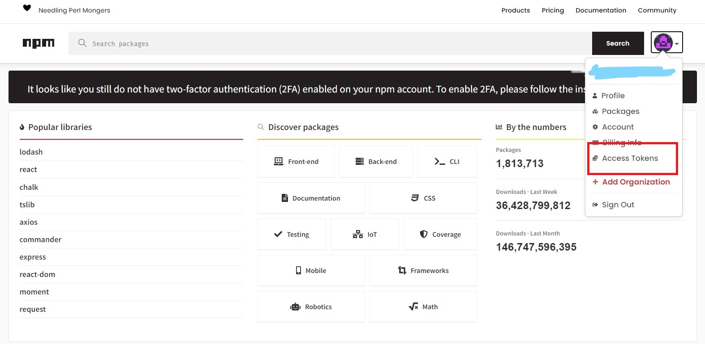
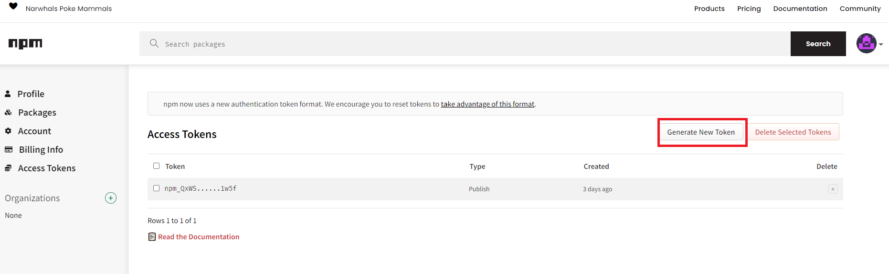
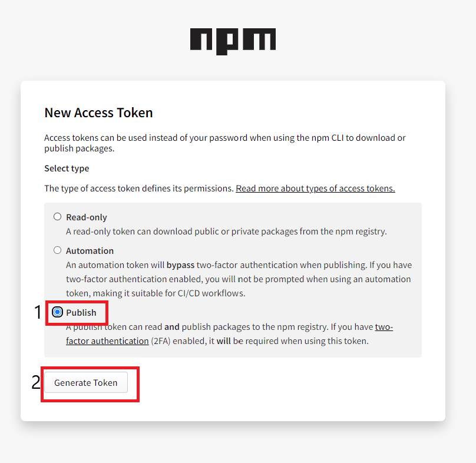
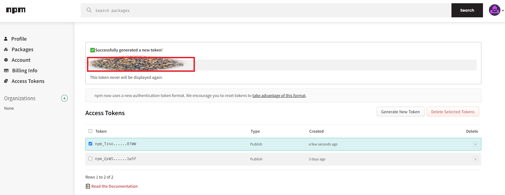
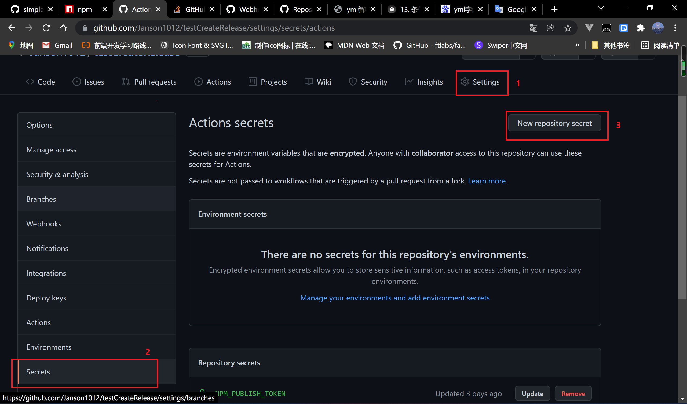
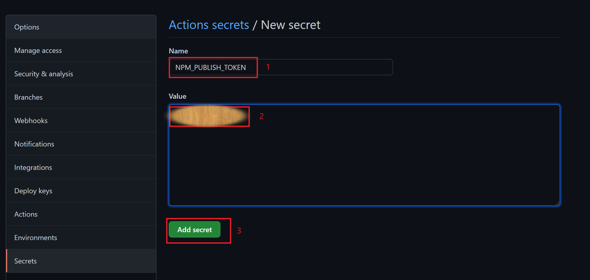
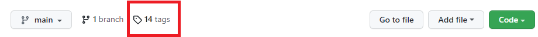
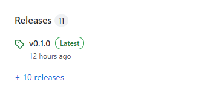
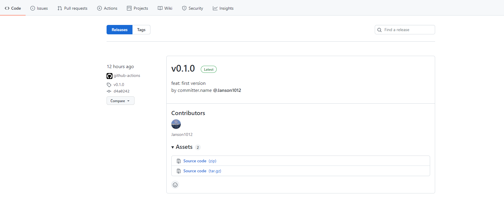

This script can help project automated create release and publish npm when you push tag.

It use four github actions.
https://github.com/actions/checkout
https://github.com/actions/setup-node 
https://github.com/pnpm/action-setup
https://github.com/yyx990803/release-tag

`Before usage`
 It need configure npm token and tokenName same with NPM_PUBLISH_TOKEN in script

​	Steps 1 









Steps 2





Usage when you want to publish

```js
git tag v0.1.0
git push origin v0.1.0
```

Result







